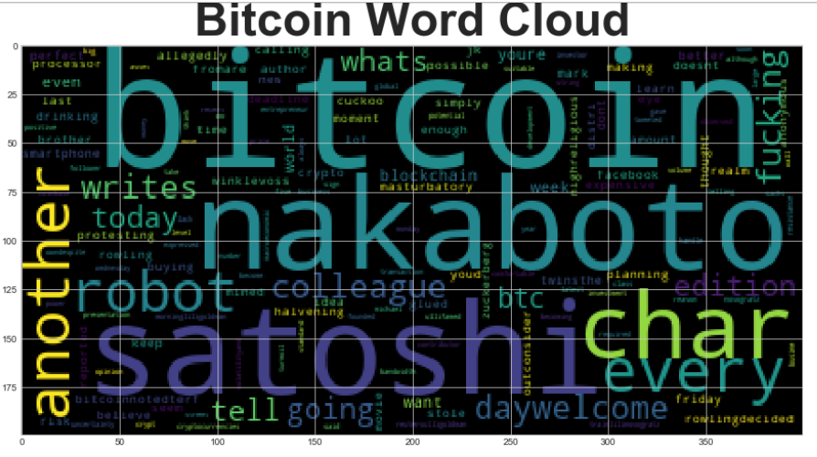
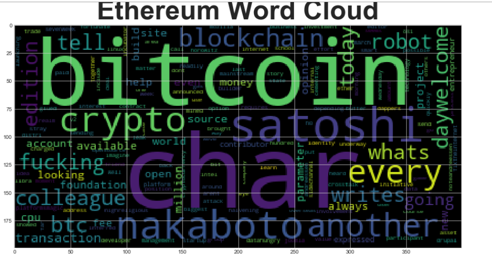

Tales from the Crypto - Natural Language Processing


## Background

As there's been a lot of hype in the news lately about cryptocurrency, we would like to invest, so to speak, of the latest news headlines regarding Bitcoin & Ethereum to get a better feel for the current public sentiment around each coin.

Using fundamental NLP techniques to understand the sentiment in the latest news article featuring Bitcoin & Ethereum and also other factors involved with the coin prices such as common words & phrases and organizations & entities mentioned in the articles.

#### Packages Used:

<br>1. [Sentiment Analysis](#Sentiment-Analysis)</br>
* Use of [Vader Sentiment Analysis](http://www.nltk.org/howto/sentiment.html)

    ```python
        from nltk.sentiment.vader import SentimentIntensityAnalyzer
        analyzer = SentimentIntensityAnalyzer()
    ```
    
<br>2. [Natural Language Processing](#Natural-Language-Processing)</br>
* Natural Language Toolkit [NLTK](https://en.wikipedia.org/wiki/Natural_Language_Toolkit)
* Tokenizing Words & Sentences with NLTK [Tokenizing](https://en.wikipedia.org/wiki/Natural_Language_Toolkit)
* Generate N-grams [N-grams](https://www.pythonprogramming.in/generate-the-n-grams-for-the-given-sentence-using-nltk-or-textblob.html)
* Word Cloud [Word_Cloud](https://amueller.github.io/word_cloud/)

<br>3. [Named Entity Recognition](#Named-Entity-Recognition)</br>
* NER [SpaCy](https://realpython.com/natural-language-processing-spacy-python/)
* Visualizer [Displacy](https://spacy.io/usage/visualizers)

- - -

### Files

[Starter Notebook](Starter_Code/crypto_sentiment.ipynb)

- - -


<details>

<summary>Sentiment Analysis</summary>
    
    
<br>1. *Use of [newsapi](https://newsapi.org/) to pull the latest news articles for Bitcoin and Ethereum*</br>
    ```
        btc_articles = newsapi.get_everything(q='bitcoin',
                                      language='en',
                                      sort_by='relevancy',
                                      )
    ```

<br>2. *Creation of Dataframe of Sentiment Scores for each coin*</br>

**Bitcoin**                     |**Ethereum**        
:-------------------------:|:-------------------------:
 | 
    
    

<br>3. *Descriptive statistics*</br>

**Bitcoin**                     |**Ethereum**     
:-------------------------:|:-------------------------:
 | 

* Which coin had the highest mean positive score?
  ```python
     Bitcoin - 0.07
  ```

* Which coin had the highest negative score? 
  ```python
     Ethereum - 0.025 
  ```

* Which coin had the highest positive score? 
  ```python
     Ethereum - 0.9198 
  ```
</ul>
    
</details>
    
<details>

<summary> Natural Language Processing </summary><br>
    
<br>1. *Import the following Libraries from nltk:*</br>
    
    ```python
        from nltk.tokenize import word_tokenize, sent_tokenize
        from nltk.corpus import stopwords
        from nltk.stem import WordNetLemmatizer, PorterStemmer
        from string import punctuation
        import re
    ```
  
<br>2. *Use NLTK and Python to tokenize the text for each coin*</br>

* Remove punctuation
    ```python   
        regex = re.compile("[^a-zA-Z0-9 ]")
        re_clean = regex.sub('', text)
    ```
* Lowercase each word
    ```python
        words = word_tokenize(re_clean.lower())
    ```
* Remove stop words
    ```python
        sw = set(stopwords.words('english'))
    ```
* Lemmatize Words into Root words
    ```python
        lemmatizer = WordNetLemmatizer()
        lem = [lemmatizer.lemmatize(word) for word in words]
    ```

<br>3. Look at the ngrams and word frequency for each coin</br>

* Use NLTK to produce the ngrams for N = 2
    ```python
        def get_token(df):
             tokens = []
        for i in df['tokens']:
            tokens.extend(i)
        return tokens
        btc_tokens = get_token(btc_sentiment_df)
        eth_tokens = get_token(eth_sentiment_df)

        #Generate the Bitcoin N-grams where N=2
        def bigram_counter(tokens, N):
        words_count = dict(Counter(ngrams(tokens, n=N)))
        return words_count
    
        bigram_btc = bigram_counter(btc_tokens, 2)
    ```

* List the top 10 words for each coin
    ```python
        # Use the token_count function to generate the top 10 words from each coin
        def token_count(tokens, N=10):
        """Returns the top N tokens from the frequency count"""
        return Counter(tokens).most_common(N)
    ```
    
**Bitcoin**                     |**Ethereum**        
:-------------------------:|:-------------------------:
 | 

* Generate word clouds for each coin to summarize the news for each coin.
    ```python
        from wordcloud import WordCloud
        import matplotlib.pyplot as plt
        plt.style.use('seaborn-whitegrid')
        import matplotlib as mpl
        mpl.rcParams['figure.figsize'] = [20.0, 10.0]
    ```
    




</details>

<details>
    <summary>Named Entity Recognition</summary>

<br>1. Import SpaCy and displacy</br>
    ```python
        import spacy
        from spacy import displacy
        # Load the spaCy model
        nlp = spacy.load('en_core_web_sm')
    ```
<br>2. Build a named entity recognition model for both coins</br>
    ```python
        # Run the NER processor on all of the text
        doc = nlp(btc_content)
        # Add a title to the document
        doc.user_data["title"] = "BITCOIN NER"
    ```
<br>3. Visualize the tags using SpaCy</br>
    ```python
        displacy.render(doc, style='ent')
    ```
    


<br>4. List all Entities</br>
    ```python
        for ent in doc.ents:
        print('{} {}'.format(ent.text, ent.label_))
     ```

**Bitcoin**                      |**Ethereum**        
:-------------------------:|:-------------------------:
 | 

</details>


- - -

